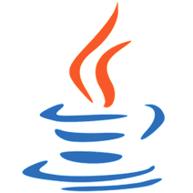

[Homepage](README.md) | [Installation](INSTALLATION.md) | [Hints and Tipps](HINTS-AND-TIPPS.md) | [API Documentation](api/index.html) | [Open Source Code](https://github.com/AndyBrunner/Domino-JAddin) | [Download](DOWNLOAD.md)

    

_Do you need to write an add-in for IBM Domino server in Java?_

The JAddin framework is a thin and easy to use layer between the Domino RunJava task and your Java application code. It helps you to create Java server tasks by freeing you to learn all the Domino add-in specifics, such as message queue handling, thread creation, communication with the console, resource cleanup, etc. It is written entirely in Java to support all Domino versions and platforms.

**Code Example**

```java
public class HelloWorld extends JAddinThread {

	// This is the main entry point. When this method returns, the add-in terminates.
	public void addinStart() {
		
		logMessage("Started with parameters " + getAddinParameters());
		
		try {
			logMessage("Running on " + dbGetSession().getNotesVersion());
		} catch (Exception e) {
			logMessage("Unable to get Domino version: " + e.getMessage());
		}

		// Main add-in loop ...
		while (true) {
			logMessage("User code is executing ...");
			waitMilliSeconds(15000L);
		}
	}

	// This method is called asynchronously by the JAddin framework when the
	// command 'Quit' or 'Exit' is entered or at Domino server shutdown. Here
	// you may signal the addinStart() method to terminate and to perform any cleanup.
	public void addinStop() {
		logMessage("Termination in progress");
	}
	
	// This method is called asynchronously by the JAddin framework for any
	// console command entered. It should be executed as quickly as possible
	// to avoid any main Domino message queue delays.
	public void addinCommand(String command) {
		logMessage("You have entered the command " + command);
	}
}
```

**Domino Console**

```text
> Load RunJava JAddin HelloWorld
03.02.2019 09:31:47   JVM: Java Virtual Machine initialized.
03.02.2019 09:31:47   RunJava: Started JAddin Java task.
03.02.2019 09:31:47   HelloWorld: Started with parameters null
03.02.2019 09:31:47   HelloWorld: Running on Release 10.0.1 November 29, 2018
03.02.2019 09:31:47   HelloWorld: User code is executing...
03.02.2019 09:32:02   HelloWorld: User code is executing...
03.02.2019 09:32:17   HelloWorld: User code is executing...
03.02.2019 09:32:32   HelloWorld: User code is executing...
```

**Prerequisites**

- IBM Domino 9.0.1 FP8 or higher (Java Virtual Machine 1.8+ requirement)

**Author**

This framework was created to help implementing projects which required the use of Domino server add-ins. If you encounter any issue or if you have a suggestion, please let me know. If you want to share some details of your projects based on JAddin, I will be glad to publish them here. You may contact me thru my email address [andy.brunner@abdata.ch](mailto:andy.brunner@abdata.ch).

**Unlicense (see [unlicense.org](http://unlicense.org))**

This software shall be used for Good, not Evil.

***

*Created with love and passion in the beautiful city of Zurich. As far as I know, no animal was harmed in the making of this software :)*
