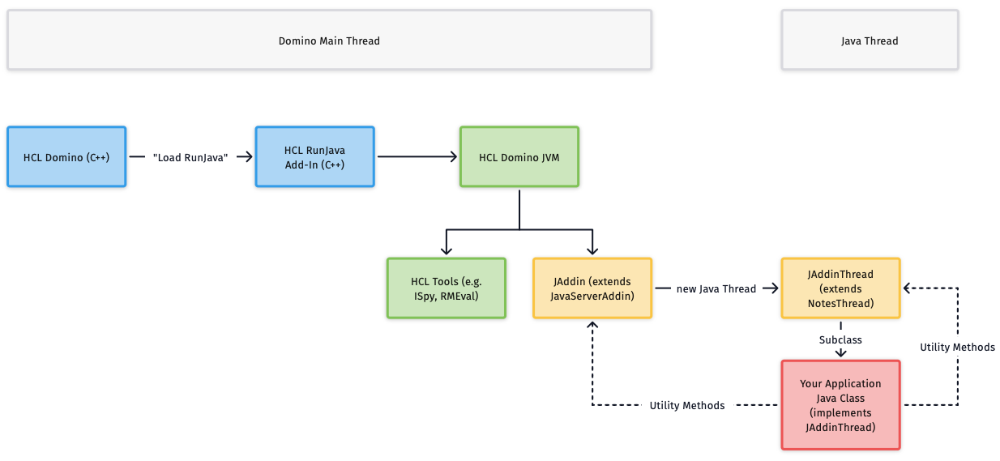

# ℹ️ Architecture

## Framework Architecture 

The JAddin architecture consists of two Java classes which are distributed with your application code.

<figure><figcaption></figcaption></figure>

### **JAddin.class**

The JAddin class is loaded by the HCL Domino RunJava task as the main Java thread. It executes under the control of RunJava and shares the HCL Domino Java Virtual Machine (JVM) with RunJava.

Main functions of JAddin thread:

* Initialize the JAddin framework
* Dynamically loads and starts the user add-in as a subclass of JAddinThread
* Monitors the Java heap space
* Acts on special framework commands (see command `Help!`)
* Supports internal debugging thru `Debug!` command
* Backcalls the user methods `addInXXX()` (see below)

### **JAddinThread.class**

This abstract class must be implemented by the user add-in class. It runs as a separate thread to minimize any delays on the normal processing of the HCL Domino server.

* Initialize the runtime environment
* Calls the user class thru addinStart()
* Includes several methods for accessing HCL Domino objects and the server environment

### **AddinName.class**

The user code runs within a subclass of JAddinThread and handles all application-specific processing. The framework invokes several callback methods that can or must be implemented by the user class. When the user class completes execution, the framework performs the necessary cleanup and terminates the main JAddin thread.

| **Method**         | **Required** | **Description**                                       |
| ------------------ | ------------ | ----------------------------------------------------- |
| addinStart()       | Yes          | Main entry point of the application code              |
| addinStop()        | Yes          | Called before termination                             |
| addinInterrupted() | No           | Returns true if main thread issued Thread.interrupt() |
| addinNextHour()    | No           | Called at each new hour                               |
| addinNextDay()     | No           | Called at each new day                                |
| addinCommand()     | No           | Called for any console command entered                |

