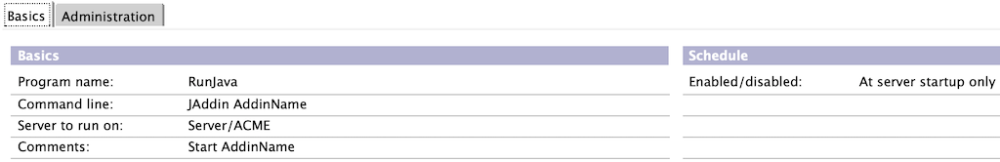

# 🚀 Installation

## 1. Prerequisites <a href="#id-1-prerequisites" id="id-1-prerequisites"></a>

* HCL Domino 9.0.1 FP8 or higher (Java Virtual Machine 1.8+ requirement)


To avoid out-of-memory errors in the Java Virtual Memory (JVM), make sure the JVM heap size is set to at least 256 MB in the Notes.ini on the HCL Domino server, e.g. `JavaMaxHeapSize=256MB`


## 2. Installation <a href="#id-2-installation" id="id-2-installation"></a>

* [Download](../download-1/download.md) and unzip the installation package.
* Copy the `JAddin.class` and `JAddinThread.class` from the installation package to your development environment.
* Copy the `notes.jar` file from your HCL Notes or HCL Domino installation to your development environment.

## 3. Application Distribution <a href="#id-3-application-distribution" id="id-3-application-distribution"></a>

To distribute and install your add-in, you must create a JAR container which includes:

* a valid `MANIFEST.MF` file&#x20;
* The framework files `JAddin.class` and `JAddinThread.class`.
* Your application class (e.g. `AddinName.class`)

### **MANIFEST.MF**

Make sure that the last line of the file is terminated with a newline character.

```
Manifest-Version: 1.0
Class-Path: .
Main-Class: AddinName
```

### **JAR container**

There are several tools available to create JAR containers. The easiest way is to use the command line.

`jar cvmf MANIFEST.MF AddinName.jar AddinName.class JAddin.class JAddinThread.class`

This example creates a new `AddinName.jar` file with the application `AddinName.class` and the two JAddin framework files.

### **Install Application**

Copy the JAR container to the `domino/ndext` directory. This directory is automatically searched by the RunJava task for any Java classes to load.

## 4. Run Application <a href="#id-4-run-application" id="id-4-run-application"></a>

There are several ways to start the application:

### **Option 1: Program Document**

The easiest and recommended way is to add a program document in the HCL Domino directory.



### **Option 2: Console Command**

Enter the command `Load RunJava JAddin AddinName` in the HCL Domino console.

```
> Load RunJava JAddin HelloWorld
03.02.2019 09:31:47   JVM: Java Virtual Machine initialized.
03.02.2019 09:31:47   RunJava: Started JAddin Java task.
03.02.2019 09:31:47   HelloWorld: Started with parameters null
03.02.2019 09:31:47   HelloWorld: Running on Release 10.0.1 November 29, 2018
03.02.2019 09:31:47   HelloWorld: User code is executing...
03.02.2019 09:32:02   HelloWorld: User code is executing...
03.02.2019 09:32:17   HelloWorld: User code is executing...
03.02.2019 09:32:32   HelloWorld: User code is executing...
```

### **Option 3: Notes.ini**

You may change the line starting with `ServerTask=` to include the task to be started, e.g.

`ServerTasks=Replica,Router,Update,RunJava JAddin AddinName,AMgr,...`
